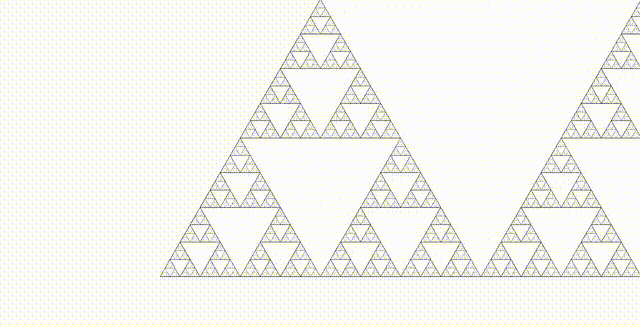

# fractals
[Sierpinski triangle](https://en.wikipedia.org/wiki/Sierpi%C5%84ski_triangle) zoom animation.

## About

Two techniques are used to support infinite zoom:
- new triangles are generated on the fly as the zoom increases
- triangles that are no longer visible are removed from memory

The new triangles are faded in to avoid a flashing effect when a new batch is added.
